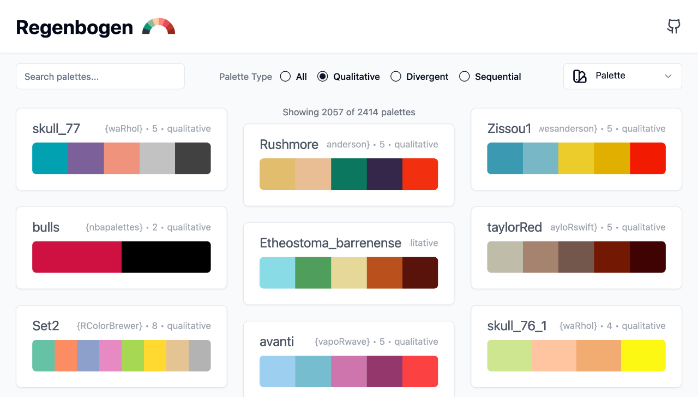
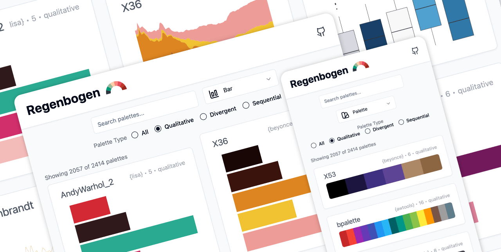

<p align="center">
  
</p>

# Regenbogen: Color Palettes for Data Visualization

Regenbogen is a small web application that allows you to explore the color palettes found in various R packages. You can browse through palettes, see how they look in different plots, and copy the code to use them in your own R, Python or any other projects.

## Usage 🌈

You can use the deployed online version at [simson.io/regenbogen/](https://simson.io/regenbogen/).

## Screenshots 🌬️





## Context 🌤️

I started this project to explore developing with LLMs more deeply. In particular, I wanted to test how far I can get with most of the code being written by AI.

While the first few versions of the app were easily generated by Claude Artifacts[^1], it quickly hit its limits when it came to more code, especially when hitting the stage where one would typically start building separate components. At some point Claude started to struggle with both, adding certain features and reaching conversation length limits. Nevertheless, it was really impressive to see how much Claude can contribute. I was particularly impressed with its ability to add virtual rendering (instead of rendering 2.4k palettes at once), where it immediately created a very workable first draft. Adding minor changes, such as triggering a re-render when the user changes the visualization type, however, was not possible.

Additionally, I had great success with manually splitting up components into separate files and asking Claude to modify those in very specifc ways. For generating normal (non React) code, I sometimes had better success with using GPT-4o instead.

However, I also noticed (mostly via version control) that the LLM generated code would sometimes introduce minor changes here or exclude parts of the prior code there. Moreover, the resulting code is often not the most maintainable or readable. While this is fine for a project like this, it does give me pause before relying too heavily on LLM generated code in bigger projects (where I feel the needed refactoring would probably eliminate efficiency gains).

[^1]: And super quickly deployed thanks to the amazing [Claude Artifact Runner](https://github.com/claudio-silva/claude-artifact-runner).

## Development ⛈️

To run the application locally, you need to have Node.js installed. Then you can clone the repository and run the following commands to get set up.

```bash
# Install dependencies (only needed once)
npm install

# Run development server
npm run dev

# Build for production / deployment
npm run build
```

## Acknowledgements ☀️

This project is heavily inspired by and drawing from [r-color-palettes](https://emilhvitfeldt.github.io/r-color-palettes/) and the [paletteer](https://emilhvitfeldt.github.io/paletteer/) package by Emil Hvitfeldt.

The first draft was generated using Claude Artifacts and the deployed using the [Claude Artifact Runner](https://github.com/claudio-silva/claude-artifact-runner) Template by Claudio Silvy.
